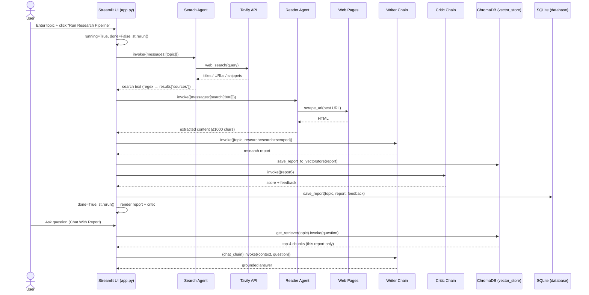

# 🔬 ResearchMind — Multi-Agent AI Research System

> A multi-agent GenAI application that turns a single research topic into a polished, critic-reviewed research report — then lets you chat with that report using Retrieval-Augmented Generation (RAG).

Built with **Streamlit · LangChain · LangGraph (ReAct agents) · Tavily · OpenRouter · SQLite · ChromaDB · ReportLab · BeautifulSoup**.

---

## 📑 Table of Contents

1. [Project Overview](#-project-overview)
2. [High-Level Architecture](#-high-level-architecture)
3. [Folder Structure](#-folder-structure)
4. [File-by-File Explanation](#-file-by-file-explanation)
5. [Application Workflow](#-application-workflow)
6. [Agent Architecture](#-agent-architecture)
7. [Database Architecture](#-database-architecture)
8. [RAG Architecture](#-rag-architecture)
9. [Backend Execution Flow](#-backend-execution-flow)
10. [Sequence Diagram](#-sequence-diagram)
11. [Technical Stack](#-technical-stack)
12. [Interview Preparation Section](#-interview-preparation-section)
13. [System Design Discussion](#-system-design-discussion)
14. [Resume Description](#-resume-description)
15. [Conclusion](#-conclusion)

---

## 🎯 Project Overview

### What problem this project solves
Manual research is slow and fragmented. A person typically has to: open a search engine, scan many results, click through to source pages, read and synthesize them, write a structured report, and then sanity-check its quality. **ResearchMind automates that entire loop.** A user types one topic and receives a structured, multi-section research report that has already been *self-reviewed* by a critic agent — and they can then ask follow-up questions about it in natural language.

### Project objective
To demonstrate a **production-style multi-agent GenAI pipeline** where specialized agents/chains each own one stage of the research workflow (search → read → write → critique), with persistence (SQLite), retrieval (ChromaDB RAG), and a polished web UI (Streamlit).

### Key features
- 🔍 **Web Search Agent** — live, recent web results via the Tavily API.
- 📄 **Reader Agent** — scrapes and extracts deep content from the most relevant URL.
- ✍️ **Writer Chain** — drafts a structured report (Introduction → Key Findings → Conclusion → Sources).
- 🧐 **Critic Chain** — scores and reviews the report (`Score: X/10`, strengths, areas to improve, verdict).
- 💬 **Chat With Report** — RAG over the generated report using ChromaDB + sentence-transformer embeddings.
- 📚 **Research History** — every report + feedback is persisted in SQLite and browsable in the UI.
- 🎨 **Custom-themed Streamlit UI** — pipeline step cards with live `WAITING / RUNNING / DONE` states.
- 🧾 **PDF export** — a Download button renders the report to PDF via `pdf_utils.create_pdf`.

### Target users
- **Students / researchers** needing a fast first-pass literature/topic synthesis.
- **Analysts / journalists** wanting a quick structured brief with sources.
- **AI engineers / learners** studying multi-agent + RAG architectures as a reference implementation.

### Business value
- **Time compression:** minutes of multi-step manual research collapsed into one click.
- **Built-in quality gate:** the Critic chain provides an automated review before a human reads the output.
- **Knowledge retention:** reports are stored and become a queryable knowledge base via RAG.
- **Extensible blueprint:** the agent/chain separation makes it cheap to add new stages (fact-checkers, summarizers, translators).

---

## 🏗 High-Level Architecture

```
                          ┌─────────────────────┐
                          │        User         │
                          └──────────┬──────────┘
                                     ↓ (enters topic, clicks "Run Research Pipeline")
                          ┌─────────────────────┐
                          │     Streamlit UI     │  app.py
                          │  (session_state FSM) │
                          └──────────┬──────────┘
                                     ↓
                          ┌─────────────────────┐      ┌──────────────┐
                          │     Search Agent     │─────▶│  Tavily API  │
                          │  (ReAct + web_search)│◀─────│  (web search)│
                          └──────────┬──────────┘      └──────────────┘
                                     ↓ (search text + extracted URLs)
                          ┌─────────────────────┐      ┌──────────────┐
                          │     Reader Agent     │─────▶│ requests +   │
                          │ (ReAct + scrape_url) │◀─────│ BeautifulSoup│
                          └──────────┬──────────┘      └──────────────┘
                                     ↓ (scraped content)
                          ┌─────────────────────┐
                          │     Writer Chain     │  prompt | LLM | StrOutputParser
                          └──────────┬──────────┘
                                     ↓ (research report)
                          ┌─────────────────────┐
                          │     Critic Chain     │  prompt | LLM | StrOutputParser
                          └──────────┬──────────┘
                                     ↓
                          ┌─────────────────────┐
                          │   Research Report    │  (rendered in UI)
                          └──────────┬──────────┘
                ┌────────────────────┼─────────────────────┐
                ↓                    ↓                     ↓
      ┌──────────────┐   ┌──────────────────────┐  ┌────────────────────┐
      │  PDF Export  │   │  Research History DB │  │   Vector Store     │
      │ (pdf_utils,  │   │   (SQLite:           │  │  (ChromaDB +       │
      │  utility*)   │   │   research_history.db)│  │   embeddings)      │
      └──────────────┘   └──────────────────────┘  └─────────┬──────────┘
                                                              ↓
                                                  ┌────────────────────┐
                                                  │  Chat With Report  │
                                                  │  (RAG, per-report) │
                                                  └────────────────────┘

  * PDF Export is triggered from the UI via a Download button (pdf_utils.create_pdf).
```

### Component responsibilities

| Component | Responsibility |
|-----------|----------------|
| **Streamlit UI** (`app.py`) | Renders the interface, captures the topic, drives the pipeline via a 3-flag state machine (`running`, `done`, `results`), and displays report/critic/chat output. |
| **Search Agent** (`agents.build_search_agent`) | A LangGraph ReAct agent given the `web_search` tool. Decides to call Tavily and returns recent web information as text. |
| **Reader Agent** (`agents.build_reader_agent`) | A LangGraph ReAct agent given the `scrape_url` tool. Picks the most relevant URL from the search output and scrapes deeper content. |
| **Writer Chain** (`agents.writer_chain`) | An LCEL chain (`prompt | llm | StrOutputParser`) that drafts a structured report from the combined research. |
| **Critic Chain** (`agents.critic_chain`) | An LCEL chain that evaluates the report and returns a structured score + feedback. |
| **Research Report** | The Writer output, rendered as Markdown in the UI. |
| **PDF Export** (`pdf_utils.create_pdf`) | Converts a report string to a PDF file via ReportLab; exposed through a Download button in the UI. |
| **Research History DB** (`database.py`) | SQLite persistence of `(topic, report, feedback, created_at)` and retrieval for the History page. |
| **Vector Store** (`vector_store.py`) | Chunks + embeds the report into ChromaDB for retrieval. |
| **Chat With Report** | RAG flow: embed question → retrieve top-k chunks → feed as context to `chat_chain`. |

---

## 📁 Folder Structure

```
multi agent system/
├── app.py                  # Streamlit UI + in-app multi-agent pipeline (main entry point)
├── agents.py               # LLM config + agents/chains (search, reader, writer, critic, chat)
├── tools.py                # LangChain tools: web_search (Tavily) + scrape_url (requests/BS4)
├── pipeline.py             # Standalone CLI version of the research pipeline
├── database.py             # SQLite layer: schema, save_report(), get_reports()
├── vector_store.py         # ChromaDB RAG layer: save_report(), get_retriever()
├── pdf_utils.py            # ReportLab PDF generation (create_pdf)
├── requirements.txt        # Pinned Python dependencies
├── research_history.db     # SQLite database file (generated at runtime; gitignored)
├── chroma_db/              # ChromaDB persistence directory (generated at runtime; gitignored)
├── .env                    # API keys (TAVILY_API_KEY, OPENROUTER_API_KEY, GROQ_API_KEY) — gitignored
├── .gitignore              # Ignores .env, .venv, node_modules, __pycache__, chroma_db, research_history.db
├── .venv/                  # Python virtual environment
├── __pycache__/            # Python bytecode cache
└── node_modules/           # Present in the workspace; not used by the Python app
```

### Purpose of every file

| File | Purpose |
|------|---------|
| `app.py` | The application. Streamlit front end **and** the orchestration of the four-stage pipeline, plus history browsing and the chat-with-report RAG UI. |
| `agents.py` | Central definition of the LLM (OpenRouter via `ChatOpenAI`) and all reasoning units: two ReAct agents and three LCEL chains. |
| `tools.py` | The two tools agents can call: `web_search` (Tavily) and `scrape_url` (HTTP + HTML parsing). |
| `pipeline.py` | A console/CLI implementation of the same pipeline (`run_reasearch_pipeline`) for running research outside Streamlit. |
| `database.py` | Relational persistence of finished reports for the **History** page. |
| `vector_store.py` | The RAG backbone: chunking, embedding, persistence, and retrieval. |
| `pdf_utils.py` | Turns a report string into a downloadable PDF document. |
| `requirements.txt` | Reproducible dependency set (LangChain, Streamlit, Chroma, Tavily, ReportLab, etc.). |
| `.env` | Secrets/keys, loaded by `python-dotenv`. |
| `research_history.db` | The on-disk SQLite database holding past reports. |

---

## 🧩 File-by-File Explanation

### `agents.py`
- **Why it exists:** single source of truth for the model and every agent/chain in the system.
- **Key objects:**
  - `llm = ChatOpenAI(model="openrouter/free", base_url="https://openrouter.ai/api/v1", api_key=OPENROUTER_API_KEY, temperature=0)` — an OpenAI-compatible client pointed at **OpenRouter**. `temperature=0` → deterministic outputs.
  - `build_search_agent()` → `create_agent(model=llm, tools=[web_search])` — a LangChain/LangGraph **ReAct agent** with the search tool.
  - `build_reader_agent()` → `create_agent(model=llm, tools=[scrape_url])` — ReAct agent with the scraping tool.
  - `writer_chain = writer_prompt | llm | StrOutputParser()` — LCEL chain; inputs `{topic, research}`, outputs a report string.
  - `critic_chain = critic_prompt | llm | StrOutputParser()` — LCEL chain; input `{report}`, outputs structured feedback.
  - `chat_chain = chat_prompt | llm | StrOutputParser()` — LCEL chain; inputs `{context, question}`, outputs a grounded answer ("Use ONLY the provided context").
- **Interacts with:** imports tools from `tools.py`; consumed by `app.py` and `pipeline.py`.
- **Inputs/Outputs:** functions return runnable agents; chains return strings.
- **Dependencies:** `langchain`, `langchain_openai`, `langchain_core`, `python-dotenv`, `tools.py`.

### `tools.py`
- **Why it exists:** defines the external capabilities agents can invoke (`@tool`-decorated functions).
- **Functions:**
  - `web_search(query: str) -> str` — calls `TavilyClient.search(query, max_results=5)`, formats each hit as `Title / URL / Snippet (≤200 chars)`, joined by separators.
  - `scrape_url(url: str) -> str` — `requests.get` (10s timeout, browser User-Agent) → `BeautifulSoup` parse → strips `script/style/nav/footer/header` → returns first **1000 chars** of text; returns an error string on exception.
- **Interacts with:** imported by `agents.py`; agents decide when to call these.
- **Inputs/Outputs:** string in → string out (tool contract).
- **Dependencies:** `langchain.tools`, `requests`, `beautifulsoup4`, `tavily-python`, `python-dotenv`.

### `app.py`
- **Why it exists:** the user-facing application and orchestrator.
- **Notable elements:**
  - **Imports:** `create_pdf` (wired to a Download button in the display block), `save_report as save_report_to_vectorstore` (Chroma), `save_report, get_reports` (SQLite), `get_retriever`, `chat_chain`, and the agents/chains.
  - `st.set_page_config(...)` + a large custom CSS block (theme, hero, step cards, panels).
  - `step_card(num, title, state, desc)` — renders a pipeline step card with `waiting/running/done` styling.
  - **Session state FSM:** initializes `results` (dict), `running` (bool), `done` (bool).
  - **Sidebar nav:** radio with `Research` and `History`. History page calls `get_reports()` and renders each `(topic, report, feedback)` inside expanders, then `st.stop()`.
  - **Button handler:** on `run_btn` click with a non-empty topic → sets `running=True`, `done=False`, `results={}`, then `st.rerun()`.
  - `s(step)` helper — computes each card's state from `results` + `running`.
  - **Pipeline block** (`if running and not done`): runs Search → (regex-extract URLs into `results["sources"]`) → Reader → Writer → store `results["topic"]` → `save_report_to_vectorstore(report, topic)` → Critic → `save_report(topic, report, feedback)` (SQLite) → sets `running=False`, `done=True`, `st.rerun()`.
  - **Display block** (`if r`): renders the report (Markdown), a **Download Report as PDF** button (`create_pdf`), the **Chat With Report** input (RAG via `get_retriever(topic=...)` + `chat_chain`), and the Critic feedback.
- **Interacts with:** every other module.
- **Dependencies:** `streamlit`, `re`, plus all project modules.

### `pipeline.py`
- **Why it exists:** a headless/CLI version of the pipeline for testing or non-UI runs.
- **Function:** `run_research_pipeline(topic) -> dict` — runs the same four stages, printing progress, and returns `state` with `search_results`, `scraped_content`, `report`, `feedback`. It is **aligned with `app.py`**: no research truncation, and it persists to both ChromaDB (`save_report_to_vectorstore`) and SQLite (`save_report`). Has an `if __name__ == "__main__"` block that prompts for a topic via `input()`.
- **Interacts with:** imports agents/chains from `agents.py`. Independent of `app.py` (not invoked by the UI).
- **Dependencies:** `agents.py`.

### `database.py`
- **Why it exists:** relational persistence of finished reports.
- **Elements:** opens `sqlite3.connect("research_history.db", check_same_thread=False)`; creates table `reports` if missing; `save_report(topic, report, feedback)` inserts a row; `get_reports()` returns all rows ordered by `created_at DESC`.
- **Interacts with:** `app.py` (write on pipeline finish, read on History page).
- **Inputs/Outputs:** strings in → rows out (list of tuples).
- **Dependencies:** standard-library `sqlite3`.

### `vector_store.py`
- **Why it exists:** the RAG layer (embed + store + retrieve).
- **Elements:**
  - `embedding_model = HuggingFaceEmbeddings("sentence-transformers/all-MiniLM-L6-v2")` (loaded at import time).
  - `save_report(report_text, topic="report")` — `RecursiveCharacterTextSplitter(chunk_size=500, chunk_overlap=50)` → `Chroma.from_texts(..., metadatas=[{"topic": topic}, ...], persist_directory="chroma_db")` (each chunk tagged with its topic).
  - `get_retriever(topic=None)` — opens Chroma at `chroma_db` and returns a retriever with `search_kwargs={"k": 4}`; when `topic` is given, adds `filter={"topic": topic}` to scope retrieval to that report.
- **Interacts with:** `app.py` (indexes the report after the Writer step; retrieves chunks during chat).
- **Inputs/Outputs:** report string in (no return); retriever out.
- **Dependencies:** `langchain_chroma`, `langchain_huggingface`, `langchain_text_splitters`.

### `pdf_utils.py`
- **Why it exists:** export a report to PDF.
- **Function:** `create_pdf(report_text, topic) -> filename` — builds a `SimpleDocTemplate`, adds a Title paragraph + the body (newlines → `<br/>`), writes `"{topic}.pdf"`, returns the filename.
- **Interacts with:** called by `app.py`'s display block, which feeds the returned file to `st.download_button`.
- **Dependencies:** `reportlab`.

---

## ⚙️ Application Workflow

What happens when the user clicks **"⚡ Run Research Pipeline"** (exact, code-traced):

```
 1. User enters a topic         → st.text_input(key="topic_input")  → `topic`
 2. User clicks the button      → run_btn = True
 3. Button handler fires        → if topic.strip():
                                     st.session_state.running = True
                                     st.session_state.done    = False
                                     st.session_state.results = {}
                                     st.rerun()                       # restart script
 4. Pipeline gate opens         → if st.session_state.running and not st.session_state.done:
 5. STEP 1 — Search             → search_agent = build_search_agent()        (agents.py)
                                   search_agent.invoke({messages:[("user", "...topic...")]})
                                   → web_search tool → Tavily API → results["search"]
 6. Extract sources             → re.findall(r'https?://[^\s]+', search) → results["sources"]
 7. STEP 2 — Reader             → reader_agent = build_reader_agent()
                                   reader_agent.invoke({messages:[... search[:800] ...]})
                                   → scrape_url tool → requests + BeautifulSoup → results["reader"]
 8. STEP 3 — Writer             → research_combined = SEARCH + SCRAPED
                                   writer_chain.invoke({topic, research}) → results["writer"]
 9. Index for RAG               → save_report_to_vectorstore(results["writer"])   (vector_store.py → ChromaDB)
10. STEP 4 — Critic             → critic_chain.invoke({report}) → results["critic"]
11. Persist to SQLite          → save_report(topic, report, feedback)            (database.py)
12. Flip state machine         → running = False; done = True; st.rerun()
13. Display block renders       → report (Markdown) + Chat box + Critic feedback
14. Chat With Report enabled    → question → get_retriever(topic).invoke(q) → context → chat_chain.invoke({context, question}) → answer
```

> **On the step "PDF generated":** the report is not auto-written to disk during the pipeline; instead the display block exposes a **Download Report as PDF** button that calls `create_pdf(report, topic)` and streams the file via `st.download_button` on demand.

Each stage also writes `st.session_state.results = dict(results)` so the right-hand **step cards** reflect `WAITING → RUNNING → DONE` on each rerun.

---

## 🤖 Agent Architecture

The system uses **two tool-using ReAct agents** (search, reader) and **three LCEL chains** (writer, critic, chat). Agents *decide and act* (tool calls); chains *transform* (deterministic prompt→LLM→string).

### 1. Search Agent
| Aspect | Detail |
|--------|--------|
| **Objective** | Gather recent, reliable web information about the topic. |
| **Construction** | `create_agent(model=llm, tools=[web_search])` — LangGraph ReAct agent. |
| **Prompt/Trigger** | `"Find recent, reliable and detailed information about: {topic}"`. |
| **Input** | `{"messages": [("user", ...)]}`. |
| **Output** | `sr["messages"][-1].content` — text containing titles/URLs/snippets. |
| **Tools used** | `web_search` → Tavily (`max_results=5`). |
| **Contributes** | Produces the raw evidence + the URL list (`results["sources"]`) for downstream stages. |

### 2. Reader Agent
| Aspect | Detail |
|--------|--------|
| **Objective** | Extract deeper content from the single most relevant source. |
| **Construction** | `create_agent(model=llm, tools=[scrape_url])`. |
| **Prompt/Trigger** | "Based on the following search results about '{topic}', pick the most relevant URL and scrape it…" + `search[:800]`. |
| **Input** | `{"messages": [("user", ...)]}`. |
| **Output** | `rr["messages"][-1].content` — scraped/extracted text. |
| **Tools used** | `scrape_url` → `requests` + `BeautifulSoup` (returns first 1000 chars). |
| **Contributes** | Adds depth beyond search snippets for the writer. |

### 3. Writer Chain
| Aspect | Detail |
|--------|--------|
| **Objective** | Produce a structured, professional report. |
| **Construction** | `writer_prompt | llm | StrOutputParser()`. |
| **Prompt design** | System: "expert research writer". Human: enforce sections — **Introduction / Key Findings (≥3) / Conclusion / Sources**. |
| **Input** | `{"topic", "research"}` where `research = SEARCH + SCRAPED`. |
| **Output** | A Markdown report string (`results["writer"]`). |
| **Tools used** | None (pure generation). |
| **Contributes** | The core deliverable; also the document indexed into ChromaDB. |

### 4. Critic Chain
| Aspect | Detail |
|--------|--------|
| **Objective** | Provide an automated quality review. |
| **Construction** | `critic_prompt | llm | StrOutputParser()`. |
| **Prompt design** | System: "sharp and constructive research critic". Human: enforce exact format — `Score: X/10`, Strengths, Areas to Improve, One-line verdict. |
| **Input** | `{"report"}`. |
| **Output** | Structured feedback string (`results["critic"]`). |
| **Tools used** | None. |
| **Contributes** | A built-in quality gate before the human reads the report. |

### (Bonus) Chat Chain — powers Chat With Report
| Aspect | Detail |
|--------|--------|
| **Objective** | Answer questions grounded strictly in retrieved report chunks. |
| **Construction** | `chat_prompt | llm | StrOutputParser()`. |
| **Prompt design** | "Use ONLY the provided context" → `{context}` + `{question}`. |
| **Input** | `{"context", "question"}`. |
| **Output** | A grounded answer string. |

---

## 🗄 Database Architecture

**File:** `research_history.db` (SQLite, opened with `check_same_thread=False`).

### Table: `reports`

| Column | Type | Notes |
|--------|------|-------|
| `id` | `INTEGER PRIMARY KEY AUTOINCREMENT` | Surrogate key. |
| `topic` | `TEXT` | The research topic. |
| `report` | `TEXT` | Full Writer-chain report. |
| `feedback` | `TEXT` | Full Critic-chain feedback. |
| `created_at` | `TIMESTAMP DEFAULT CURRENT_TIMESTAMP` | Auto timestamp for ordering. |

### Relationships
A single, **denormalized** table — one row = one completed research run. No foreign keys or joins (sources are embedded inline in the report text rather than normalized into a separate table).

### Data flow
```
Pipeline finishes ─▶ save_report(topic, report, feedback) ─▶ INSERT INTO reports
History page      ─▶ get_reports() ─▶ SELECT * ... ORDER BY created_at DESC ─▶ expanders in UI
```

---

## 🔎 RAG Architecture

The **Chat With Report** feature is a Retrieval-Augmented Generation pipeline built on **ChromaDB**.

| Element | Implementation |
|---------|----------------|
| **Vector store** | `Chroma` with `persist_directory="chroma_db"`. |
| **Embeddings** | `HuggingFaceEmbeddings("sentence-transformers/all-MiniLM-L6-v2")` — 384-dim sentence embeddings, runs locally (no API cost). |
| **Chunking** | `RecursiveCharacterTextSplitter(chunk_size=500, chunk_overlap=50)` — splits the report into overlapping ~500-char chunks. |
| **Indexing** | After the Writer step: `Chroma.from_texts(chunks, embedding_model, metadatas=[{"topic": topic}...], persist_directory)` — each chunk tagged with its topic. |
| **Retrieval** | `db.as_retriever(search_kwargs={"k": 4, "filter": {"topic": topic}})` — top-4 most similar chunks (cosine similarity), scoped to the current report. |
| **Generation** | Retrieved chunks → joined as `context` → `chat_chain.invoke({context, question})`. |

### Chat With Report flow

```
        Question (user types in UI)
              ↓
        get_retriever(topic)            # vector_store.py (filter={"topic": topic})
              ↓
        Embed question → Vector Search   # ChromaDB (k=4, cosine, topic-scoped)
              ↓
        Relevant Chunks                  # top-4 chunks from THIS report
              ↓
        context = "\n\n".join(chunks)
              ↓
        chat_chain  (prompt | LLM | StrOutputParser)   # "Use ONLY the provided context"
              ↓
        Answer (st.write)
```

> **Design note:** retrieval is **scoped per report**. Each chunk is indexed with `{"topic": topic}` metadata, and `get_retriever(topic=...)` applies a Chroma `filter={"topic": topic}` so the chat answers only from the current report's chunks. (Calling `get_retriever()` with no topic falls back to searching the whole collection.)

---

## 🔁 Backend Execution Flow

```
User Action            ── clicks "Run Research Pipeline" (topic entered)
       ↓
Frontend Event         ── run_btn = True → set running=True, done=False, results={} → st.rerun()
       ↓
Backend Processing     ── `if running and not done:` block executes top-to-bottom (within Streamlit reruns)
       ↓
Agent Calls            ── build_search_agent().invoke(...)  →  build_reader_agent().invoke(...)
       ↓
Tool Calls             ── web_search → Tavily API ; scrape_url → requests + BeautifulSoup
       ↓
LLM Calls              ── ReAct reasoning (agents) + writer_chain + critic_chain + chat_chain (OpenRouter)
       ↓
Storage Layer          ── ChromaDB (save_report_to_vectorstore) + SQLite (save_report)
       ↓
Response Rendering     ── done=True → st.rerun() → display block renders report + critic + chat box
```

---

## 📊 Sequence Diagram



---

## 🛠 Technical Stack

| Technology | Role in this project | Why it was selected |
|------------|----------------------|---------------------|
| **Streamlit** | Front end + app runtime (`app.py`). | Pure-Python reactive UI; rapid build of data/AI apps with no separate front-end stack. |
| **LangChain** | LCEL chains (writer/critic/chat) + tool abstraction (`@tool`). | Standard, composable primitives for prompts → LLM → parsers and tool definitions. |
| **LangGraph (ReAct agents)** | `create_agent` for search/reader agents. | Gives agents reason-act-observe loops to decide *when* to call tools. |
| **Tavily** | Live web search (`web_search`). | Search API purpose-built for LLMs, returning clean, ranked, snippet-rich results. |
| **OpenRouter (via `ChatOpenAI`)** | LLM gateway for all generation/reasoning. | OpenAI-compatible endpoint that routes to many models behind one API/key. |
| **SQLite** | Report history persistence (`research_history.db`). | Zero-config embedded relational DB; perfect for local single-file persistence. |
| **ChromaDB** | Vector store for RAG. | Lightweight, local-first vector DB with simple LangChain integration + on-disk persistence. |
| **HuggingFace `all-MiniLM-L6-v2`** | Sentence embeddings for RAG. | Small, fast, strong-quality local embeddings — no per-call API cost. |
| **ReportLab** | PDF generation (`pdf_utils.py`). | Mature, programmatic PDF construction in pure Python. |
| **BeautifulSoup4** | HTML parsing in `scrape_url`. | Robust, forgiving HTML parsing to extract clean text. |
| **Requests** | HTTP fetching in `scrape_url`. | Simple, reliable synchronous HTTP client. |
| **python-dotenv** | Loads API keys from `.env`. | Keeps secrets out of code and version control. |

---

## 🎓 Interview Preparation Section

> 30 questions grounded in *this* codebase, grouped by theme, with detailed answers.

### A. Architecture (1–6)

**1. Describe the overall architecture of ResearchMind.**
A Streamlit front end drives a four-stage multi-agent pipeline: two tool-using ReAct agents (Search → Reader) gather evidence, then two LCEL chains (Writer → Critic) produce and review the report. Results persist to SQLite (history) and ChromaDB (RAG), and a chat chain answers questions over the indexed report. State is coordinated by three Streamlit `session_state` flags (`running`, `done`, `results`).

**2. Why split the work across agents/chains instead of one big prompt?**
Separation of concerns: each unit has one objective, its own prompt, and (for agents) its own tools. This improves reliability (smaller tasks), debuggability (inspect each stage's output in `session_state.results`), and extensibility (insert a fact-checker between Reader and Writer without touching the others).

**3. When did you use an *agent* vs a *chain*, and why?**
Agents (`create_agent`) for stages that must *decide to act* — searching and scraping require tool calls and reasoning about which URL to fetch. Chains (LCEL `prompt | llm | parser`) for deterministic transformations — writing and critiquing are single-shot text-to-text with no tool use.

**4. How does the UI know which pipeline step is running?**
The `s(step)` helper inspects `session_state.results` and `running`: a step is `done` if its key exists in `results`, `running` if it's the first key not yet present while `running` is True, else `waiting`. Each stage writes `results` back to `session_state`, so reruns advance the step cards.

**5. Why is the pipeline wrapped in `if running and not done`?**
Streamlit re-executes the whole script on every interaction. The flag gate ensures the expensive pipeline runs **once** per click, then flips `done=True` so subsequent reruns skip straight to rendering.

**6. What are the main failure points and how are they surfaced?**
External calls (Tavily, scraping, LLM) can fail. `scrape_url` catches exceptions and returns an error string; other failures would raise inside the `with st.spinner` block and surface as a Streamlit traceback. (Hardening these with try/except + user-facing messages is a listed improvement.)

### B. LangChain / LCEL (7–13)

**7. What does `prompt | llm | StrOutputParser()` mean?**
It's LCEL (LangChain Expression Language) piping: the prompt template formats inputs into messages, the LLM generates a `ChatMessage`, and `StrOutputParser` extracts the plain string `.content`. The composed object is a `Runnable` with `.invoke()`.

**8. Difference between `ChatPromptTemplate.from_messages` and `from_template`?**
`from_messages` builds a multi-role template (system + human), used for writer/critic. `from_template` builds a single string template, used for the chat prompt. Both produce prompt `Runnable`s.

**9. Why `temperature=0`?**
Determinism and factual consistency — research reports and critiques should be stable and reproducible rather than creative.

**10. What is `create_agent` and what does it return?**
A LangChain/LangGraph factory that builds a ReAct-style agent graph bound to a model + tools. It returns a runnable invoked with `{"messages": [...]}`; the agent loops (reason → call tool → observe) until it produces a final message, accessed via `result["messages"][-1].content`.

**11. How are tools defined and discovered?**
With the `@tool` decorator on a typed function with a docstring. The docstring + signature become the tool's schema, which the LLM uses to decide when/how to call it. Tools are passed to `create_agent(tools=[...])`.

**12. How is the LLM configured to use OpenRouter?**
Via `ChatOpenAI(base_url="https://openrouter.ai/api/v1", api_key=OPENROUTER_API_KEY, model="openrouter/free")`. Because OpenRouter is OpenAI-compatible, the standard `ChatOpenAI` client works by just changing the base URL and key.

**13. How would you stream the report to the UI token-by-token?**
Use the chain's `.stream()` instead of `.invoke()` and feed tokens into `st.write_stream()` (or a placeholder `st.empty()`), improving perceived latency for the long Writer output.

### C. Multi-Agent (14–18)

**14. How is context passed between agents?**
Explicitly through the orchestrator (`app.py`): Search output text (and `search[:800]`) is injected into the Reader prompt; Search + Reader outputs are concatenated into `research` for the Writer; the Writer output becomes the Critic's `report`. There's no shared memory object — the app threads data stage to stage.

**15. Is this orchestration sequential or graph-based?**
Sequential/linear orchestration written imperatively in `app.py` (with a behavior-aligned CLI mirror in `pipeline.py`). The *individual agents* are graph-based (LangGraph ReAct), but the *pipeline* is a hand-coded chain of `.invoke()` calls.

**16. Could LangGraph orchestrate the whole pipeline?**
Yes — model the four stages as nodes with typed state edges, enabling conditional branches (e.g., loop Writer↔Critic until score ≥ 8), retries, and parallelism. The current code keeps orchestration in Python for simplicity.

**17. Why does the Reader only get `search[:800]`?**
To control prompt size/cost and force the agent to choose among the top results rather than re-ingesting the entire search dump.

**18. How would you add a "fact-checker" agent?**
Insert a stage after Writer that extracts claims, calls `web_search`/`scrape_url` to verify them, and returns annotations — then feed both report and annotations to the Critic. Because stages are decoupled, only the orchestrator changes.

### D. RAG (19–24)

**19. Walk through the RAG pipeline.**
On report creation, the text is split into 500-char overlapping chunks and embedded with MiniLM into ChromaDB. On a question, the retriever embeds the query, does top-4 cosine search, joins the chunks as `context`, and `chat_chain` answers using only that context.

**20. Why chunk at 500/50?**
500-char chunks keep each embedding semantically focused and fit comfortably in context; 50-char overlap preserves continuity across chunk boundaries so answers aren't cut mid-thought.

**21. Why a local embedding model instead of an API?**
`all-MiniLM-L6-v2` is small, fast, and free to run locally — no per-call cost or rate limits, and it keeps report content on-device for embedding.

**22. How is retrieval scoped to a single report?**
Each chunk is indexed with `{"topic": topic}` metadata, and `get_retriever(topic=...)` passes `filter={"topic": topic}` to Chroma, so a question only retrieves chunks from the current report — no cross-report leakage. Omitting the topic falls back to searching the whole collection.

**23. How would you reduce hallucination here?**
The prompt already says "Use ONLY the provided context." Strengthen with: instructing it to answer "not in the report" when unsupported, returning citations/snippets, and raising `k` or adding a re-ranker for better recall.

**24. ChromaDB vs FAISS vs pgvector — when to pick which?**
Chroma: local-first, easy, great for prototypes (this project). FAISS: in-memory, fastest for large local indexes, no built-in persistence/metadata server. pgvector: when you already run Postgres and want SQL + vectors + transactions in one managed store (production).

### E. Database (25–27)

**25. Why SQLite and what are its limits here?**
Zero-config single-file persistence — ideal locally. Limits: concurrent writes are serialized; not suited to high-concurrency multi-user web traffic. `check_same_thread=False` is used because Streamlit may touch the connection from different threads (a real multi-user app should use a connection pool / managed DB).

**26. Why is the schema denormalized?**
One row per run with `report` and `feedback` as TEXT keeps reads/writes trivial for a single-user tool. Sources live inside the report text. Normalizing (separate `sources` table) would help analytics/querying but adds complexity not needed at this scale.

**27. How do History and the DB interact?**
The History page calls `get_reports()` (`SELECT * ... ORDER BY created_at DESC`) and renders each row's `topic/report/feedback` inside expanders, then `st.stop()` so the research UI doesn't also render.

### F. Deployment / Production (28–30)

**28. How would you deploy this?**
Containerize with a Dockerfile (`pip install -r requirements.txt`, `streamlit run app.py`), inject keys via environment/secret manager, and host on Streamlit Community Cloud, a VM, or a container service. Persist `research_history.db` and `chroma_db/` on a mounted volume (or migrate to managed services).

**29. How do you manage secrets?**
`.env` + `python-dotenv` locally (and `.env` is gitignored). In production, use the platform's secret store / `st.secrets` rather than committing keys.

**30. What observability would you add for production?**
Structured logging around each stage, latency/error metrics per agent and tool, token/cost tracking, and LLM tracing (e.g., LangSmith — `langsmith` is already in `requirements.txt`) to inspect prompts, tool calls, and failures.

---

## 🧠 System Design Discussion

### Current limitations
- **No error handling around external calls** in the pipeline (Tavily/LLM failures raise raw tracebacks; only `scrape_url` catches exceptions).
- **Single-user assumptions** — module-level SQLite connection and `session_state` design aren't built for many concurrent users.
- **Reader scrapes only one URL** (and `scrape_url` returns the first 1000 chars); depth is limited.
- **Synchronous, blocking** stages — the user waits through every LLM/network call.

> Three earlier limitations have been **resolved**: PDF export is now wired into the UI (Download button → `create_pdf`); RAG retrieval is **scoped per report** via chunk `topic` metadata + a Chroma filter; and `pipeline.py` is **aligned** with `app.py` (no truncation divergence, same persistence).

### Scalability concerns
- SQLite write serialization and a shared connection become a bottleneck under concurrency.
- ChromaDB local persistence and local embedding inference don't scale horizontally.
- Long, blocking LLM calls tie up the Streamlit session/thread.

### Future improvements
- Wrap each stage in try/except with user-facing messages + retries/backoff.
- Implement the **Critic→Writer feedback loop** (regenerate until `Score ≥ 8`) using LangGraph.
- Add **streaming** outputs and a progress log; cache agents with `@st.cache_resource`.
- Extract the shared four-stage logic into a single module that both `app.py` and `pipeline.py` import (behavior is already aligned; this removes the remaining code duplication).
- Scope SQLite history per report and add multi-user `user_id` separation.

### Production architecture (target)
```
        ┌──────────────┐     ┌─────────────────────┐     ┌────────────────────┐
        │  Web Client  │────▶│   FastAPI gateway    │────▶│  Orchestrator       │
        │ (React/Strml)│     │  (auth, rate-limit)  │     │  (LangGraph)        │
        └──────────────┘     └─────────┬───────────┘     └─────────┬──────────┘
                                       │ enqueue                    │
                                 ┌─────▼─────┐               ┌──────▼───────┐
                                 │  Queue    │──── workers ─▶│  Agents/Tools│
                                 │(Redis/SQS)│               │ (async)      │
                                 └───────────┘               └──────┬───────┘
                                                                    │
                   ┌──────────────┬───────────────┬────────────────┤
                   ▼              ▼               ▼                ▼
            ┌────────────┐ ┌────────────┐  ┌────────────┐  ┌──────────────┐
            │ Postgres   │ │ pgvector / │  │  Object    │  │ LangSmith /  │
            │ (history)  │ │ managed VDB│  │  store(PDF)│  │ observability│
            └────────────┘ └────────────┘  └────────────┘  └──────────────┘
```

### How to scale to 10,000 users
1. **Decouple UI from compute:** move the pipeline behind a **FastAPI** service; run research as **async background jobs** on a queue (Redis/Celery or SQS) so requests don't block.
2. **Stateless workers + autoscaling:** horizontally scale worker pods; cache/reuse model clients.
3. **Managed data layer:** replace SQLite with **Postgres** (+ connection pooling) and ChromaDB with a **managed/clustered vector DB** (e.g., pgvector or a hosted Chroma); store PDFs in object storage.
4. **LLM throughput:** use OpenRouter routing + provider fallbacks, request batching, and **caching** of repeated topics/embeddings.
5. **Resilience & cost control:** retries with backoff, circuit breakers, per-user rate limits, token-budget guards.
6. **Observability:** LangSmith tracing + metrics/alerting on latency, error rate, and cost per request.
7. **Multi-tenancy:** scope reports/vectors by `user_id` (metadata filters) and enforce auth at the gateway.

---

## 📄 Resume Description

**2-line version**
> Built **ResearchMind**, a multi-agent GenAI research assistant (LangChain/LangGraph + Streamlit) that automates web search, scraping, report writing, and automated critique. Added a ChromaDB RAG "chat with report" layer plus SQLite history persistence.

**5-line version**
> Designed and built **ResearchMind**, a production-style multi-agent AI system that converts a single topic into a structured, self-reviewed research report.
> Orchestrated two LangGraph ReAct agents (Tavily web search + BeautifulSoup scraping) and two LCEL chains (writer + critic) behind a custom Streamlit UI with a live pipeline state machine.
> Implemented a RAG "Chat With Report" feature using ChromaDB and `all-MiniLM-L6-v2` embeddings with recursive chunking and top-k retrieval.
> Persisted every run to SQLite for a browsable research history and added a ReportLab PDF export utility.
> Integrated LLMs through an OpenAI-compatible OpenRouter gateway with deterministic (temperature 0) generation.

**Project explanation for interviews (spoken)**
> "ResearchMind is a multi-agent research assistant. A user enters a topic and clicks run; behind that, I orchestrate four stages. A Search agent calls Tavily for recent web results; a Reader agent picks the best URL and scrapes it with BeautifulSoup — both are LangGraph ReAct agents because they need to decide when to use tools. Then two LCEL chains take over: a Writer chain drafts a structured report, and a Critic chain scores and reviews it. I persist each report to SQLite for history and index it into ChromaDB so the user can chat with the report through a RAG flow — embed the question, retrieve the top-4 chunks, and answer strictly from that context. The whole thing runs in Streamlit, coordinated by a small session-state machine so the pipeline runs exactly once per click and the step cards animate. If asked to productionize, I'd move the pipeline behind FastAPI as async jobs on a queue, swap SQLite/Chroma for Postgres/pgvector, and add tracing with LangSmith."

---

## ✅ Conclusion

**ResearchMind** is a compact but complete demonstration of modern GenAI engineering: a **multi-agent pipeline** (tool-using ReAct agents + LCEL chains) that performs end-to-end research, an automated **quality-review** step, durable **relational persistence**, and a **RAG** layer that turns each report into a conversational knowledge source — all behind a polished Streamlit interface coordinated by a clean session-state machine.

Technically it showcases: agent-vs-chain design decisions, tool definition and invocation, prompt engineering for structured outputs, embeddings + vector retrieval, and pragmatic integration of search, scraping, LLM, SQL, and PDF subsystems. The architecture is intentionally modular, so the natural next steps — error handling, a Critic→Writer feedback loop, per-report RAG scoping, and a FastAPI/queue-based production deployment — slot in without rewriting the core. It stands both as a usable research tool and as a reference blueprint for multi-agent + RAG systems.
